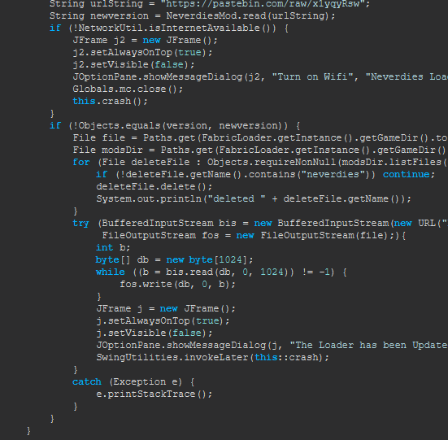
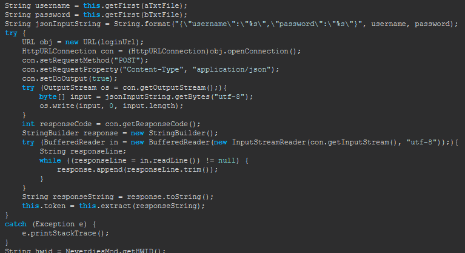

# neverdies-for-everyone
from their github repo

### Credits
- [Rom](https://github.com/Romdotpng) - Removing hwid system, Leaks
- [Chronos](https://github.com/ChronosMain) - skidding shoreline
- [Mortex8](https://github.com/Mortex8) - skidding shoreline

if you have any problems, contact hlu_nsc on discord

Neverdies also has a code that allows developers to put a rat (remote access trojan) in at any time!
Neverdies developers are false and should not be trusted 😂.

### Images

### Neverdies Invite Codes
yTuoIgjX1p
0Xo28ZAZIn
6VMQhcK3Dc
O0YatXaGXV
kSKpwhOc2j
SNKF6tukgQ
XgowicmpJH
EeWgoHpR7E
daKp12aRYW
MbTcRMq6mD 

### Neverdies Login
Chronos
abcd1234
arch
mr_haker_xd
MORTEX8
!Freibergs2008.
DasSchallert
dasschallert@123
Camizoid
83782384
Soma
spongyabob1
yakyyakyyou
yakyak123
LachCrafter
123!LLL
Fastplays08
playspa55
Postmandjonn
Anton123

### Neverdies Hwid
48f65a8169797685bd48a809c0af6019895906c0271dc55e29b1920f1aa1e4b8
2023e5b7d47a1718e5cdb452bab5fa524083e7d7dd5ca0aea1bdb68bc74cc99a
b55a5f4eb9a4e703032655603e3903746bd74d9434a171fbe6d267fe21e0237c
8acebad6451497e1da3295080841081c7a749525a043d811d78287f63b9c258a 
22eef0eae8e00622ec95c6c1bb0415b0c65a11ed18d7e3b6479f7b94799c11c7
42c6c46995732e172f6772e3df6e0ffc3599cd559bce59213f93002f7f02683d
45e111fc75d438817548c9d702be79502347f54cf8abb0c735d75099903aa9e1
506d0e8b340e27086ead3b7235cbf657bbbd9c4ea97b9c514bc1cddd1c429c5c
52baf377398456afdee6b5984fb118d9760490259184031b501b788875095a52
c29033bd05ff962116ca6c15fc40c5e4e685a007532139d3e3b296d3c7852f28
927cbc892611f3693903ebf2cc87a9604d796e2202c26259b5bd349968f2fc86 
e249bdd0637c31485e9c7bb28b7c62981d2e1e52af2a38b0ef3fd741c77a786f
7f7666aba1093c818b510d0337bd0abde862abdcd6a88a3249b120072a6f15ad

### Neverdies Loader Version
1.0.7
